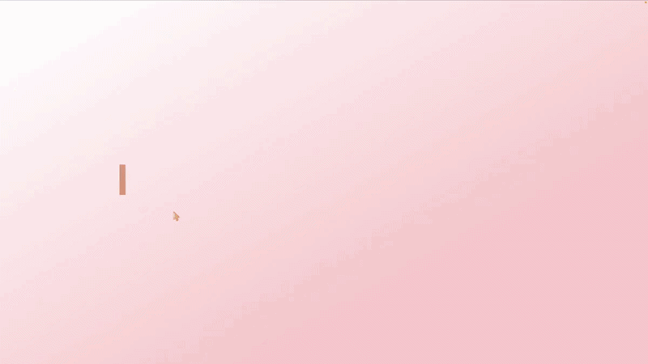

<div align="center">

# laurenshutt.dev

Second iteration of [laurenshutt.dev](https://laurenshutt.dev). Handcoded with &hearts; and hosted with [Netlify](https://www.netlify.com/). 

</div>



This is a repo for my personal portfolio site. I wanted to create an early-2000s analog whimsy that could evoke the feeling of when I first fell in love with web development. I focused on building an immersive UI, with gamified microinteractions and a playful codebase featuring accessibility-aware components and lightweight, framework-free JavaScript. 

## Features
- Window-based UI system (open, minimize, maximize)
- Navigation caret to track visible sections
- Scroll-driven animations using IntersectionObserver
- Interactive background canvas
- Custom cursor interactions
- Faux chatbot
- Contact form

## Tech Stack
- HTML5 / CSS3
- Vanilla JavaScript (modular)
- VSCode
- Github
- Netlify

## Notes
A big focus of this project was building interactive UI patterns from scratch instead of relying on libraries. The functionality is driven by modular JavaScript, with small, focused pieces handling specific behaviors.

I put particular care into naming conventions and structure so that components and behaviors remain readable and predictable as the project grows. The goal was to make the codebase feel navigable and maintainable, not just functional.

This project also served as a space to experiment with layout, motion, and state management in a way that felt more exploratory than production-constrained. One of my main goals was to balance personality with usability by keeping the experience expressive without making it confusing or overwhelming.

## Usage
Feel free to look through the code if you’re curious or evaluating my work, but please don’t copy or reuse the design or content without [reaching out to me](mailto:hello@laurenshutt.dev) first. 

## How to run locally
```
git clone https://github.com/laurenshutt/laurenshutt.dev.git
cd laurenshutt.dev
open index.html
```

## Roadmap
- [ ] Tooltip for come back soon links
- [ ] Refine about section
- [ ] Project filters
- [ ] In-depth project info on click
- [ ] Catbot
- [ ] Contact form
- [ ] Mobile layout
- [ ] Cross-browser testing
- [x] Working minimize/maximize/close window buttons
- [x] Music toggle

## Contact
LinkedIn / Email

## Copyright
Copyright © Lauren Shutt 2026. All rights reserved.